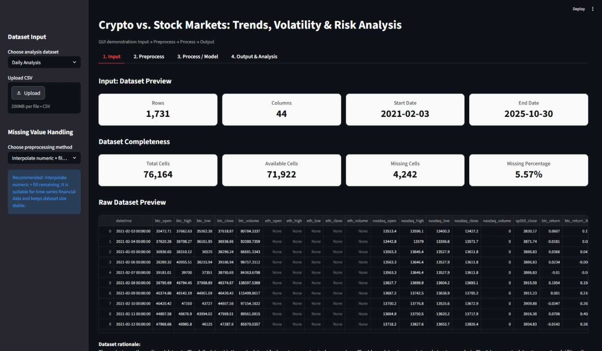
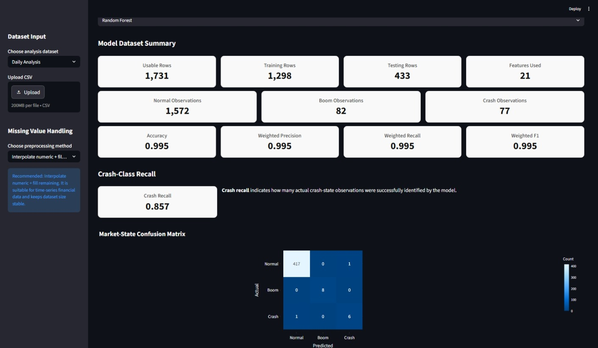
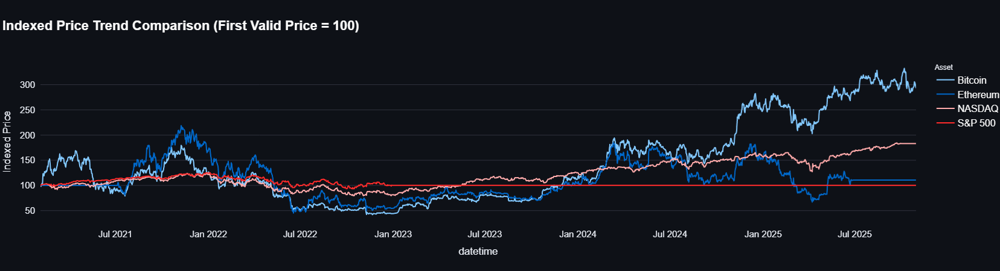
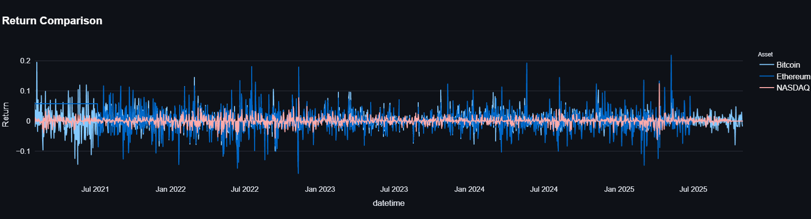

# AI-Powered Interactive Analysis of Cryptocurrency and Stock Markets

An interactive machine-learning and financial analytics system for comparing cryptocurrency and traditional stock-market behaviour using **Bitcoin, Ethereum, NASDAQ, and S&P 500 data from 2021–2025**.

The project combines financial data preprocessing, time-series alignment, financial feature engineering, multiclass machine-learning classification, risk analysis, and interactive visualization through a Streamlit dashboard.

---
## Live Demo

[Launch the Interactive Streamlit Dashboard](https://crypto-stock-market-intelligence.streamlit.app/)

---

## Research Publication

**Paper:** *AI-Powered Interactive Analysis of Cryptocurrency and Stock Markets Using Machine Learning Techniques for Risk and Trend Evaluation*

- Presented at **ISBM 2026**
- **Paper ID:** 11
- Accepted for publication in **Springer Nature — Lecture Notes in Networks and Systems (LNNS)**
- **Publication year:** 2026

The final citation, DOI, and publication link will be added once the paper is officially available online.

---

## Key Results

The study evaluates two machine-learning models for historical market-state classification.

| Model | Accuracy | Weighted Precision | Weighted Recall | Weighted F1-score |
|---|---:|---:|---:|---:|
| Random Forest | 99.50% | 99.50% | 99.50% | 99.50% |
| Logistic Regression | 97.70% | 98.60% | 97.70% | 98.00% |

The models classify historical market conditions into three classes:

- **Class 0 — Normal**
- **Class 1 — Boom**
- **Class 2 — Crash**

Random Forest achieved the strongest overall performance in the reported experiment.

---

## Dashboard Preview

### Dataset Overview



### Market-State Classification



### Indexed Price Trend



### Return Comparison



---

## Assets Analyzed

- Bitcoin (BTC)
- Ethereum (ETH)
- NASDAQ
- S&P 500

**Study period:** 2021–2025

---

## Project Overview

The project develops an interactive crypto-stock market intelligence framework for analyzing differences and relationships between cryptocurrency and traditional financial markets.

The workflow includes:

- Financial data preprocessing
- Date and time standardization
- Missing-value handling
- Time-series alignment
- Financial feature engineering
- Cryptocurrency vs. stock-market comparison
- Return and volatility analysis
- Drawdown and market-risk analysis
- Boom and crash identification
- Rolling correlation analysis
- Multiclass machine-learning classification
- Interactive scenario testing
- Interactive visualization using Streamlit and Plotly

The system is organized around four main stages:

1. **Input**
2. **Preprocess**
3. **Process / Model**
4. **Output & Analysis**

---

## Final Datasets

Three processed datasets are included in the repository.

### `FINAL_Daily_Analysis.csv`

Main dataset used for long-term cryptocurrency and stock-market comparison and machine-learning classification.

- **1,731 observations**
- **44 variables**
- **76,164 total data cells**

### `FINAL_4H_Aligned.csv`

Used for medium-term market structure and trend analysis.

### `FINAL_1H_Crypto_Aligned.csv`

Used for short-term cryptocurrency movement, volatility, and event-timing analysis.

---

## Data Preprocessing

The preprocessing workflow includes:

- Standardizing column names
- Converting timestamps into datetime format
- Sorting observations chronologically
- Checking duplicate timestamps
- Identifying missing values
- Handling missing values using interpolation, forward filling, and backward filling
- Resampling Ethereum hourly data into daily observations
- Aligning cryptocurrency and stock-market data using a common time index
- Creating analysis-ready datasets
- Preserving chronological order for financial time-series analysis

The daily dataset initially contained:

- **4,242 missing cells**
- **5.57% missing data**
- **94.43% available data**

Extreme observations were retained because strong upward and downward movements may represent genuine financial events such as market booms and crashes.

Additional preprocessing details are available in:

[`PREPROCESSING.md`](PREPROCESSING.md)

---

## Financial Feature Engineering

The project uses engineered financial indicators to represent trend, volatility, risk, and market connectedness.

Key features include:

- Daily returns
- 30-day returns
- Rolling volatility
- Drawdown
- Boom indicators
- Crash indicators
- Rolling correlation
- Convexity proxy
- Liquidity-cost proxy
- Risk ratio

These indicators are used for both visual analysis and machine-learning classification.

---

## Market-State Classification

The machine-learning component identifies three historical market states:

```text
0 = Normal
1 = Boom
2 = Crash
```

Crash observations are given priority during target construction.

The target is generated from the engineered Bitcoin boom and crash indicators.

### Models

Two classification models are included:

- **Random Forest**
- **Logistic Regression**

Random Forest is used as the primary nonlinear classifier, while Logistic Regression provides a simpler and more interpretable baseline.

The implementation preserves chronological ordering so that older observations are used for training and newer observations are used for testing.

---

## Interactive Market-State Prediction

The Streamlit dashboard provides an interactive scenario-classification interface.

Users can:

1. Select a historical observation
2. View its financial indicators
3. Adjust selected market indicators using sliders
4. Generate a new market-state classification
5. View the predicted class
6. View model confidence and class probabilities when available

Possible outputs are:

- **Normal**
- **Boom**
- **Crash**

This feature is intended for historical analysis and academic demonstration rather than fixed-horizon financial forecasting.

---

## Analysis Features

The dashboard contains eight major financial analysis components.

### 1. Price Trend Analysis

Compares Bitcoin, Ethereum, NASDAQ, and S&P 500 using normalized indexed prices.

### 2. Daily and Periodic Returns

Examines return behaviour across cryptocurrency and stock-market assets.

### 3. Volatility Measurement

Uses rolling volatility to compare market instability across assets.

### 4. Crash Period Detection

Identifies strong negative Bitcoin market movements using the engineered crash indicator.

### 5. Boom Period Identification

Highlights unusually strong positive Bitcoin market movements.

### 6. Correlation / Connectedness

Examines time-varying relationships between cryptocurrency and traditional stock markets.

### 7. Crypto vs. Stock Market Comparison

Compares market behaviour across digital and traditional financial assets.

### 8. Risk Analysis

Uses volatility and cross-market risk indicators to compare cryptocurrency and stock-market risk.

---

## Key Findings

The analysis indicates that:

- Bitcoin and Ethereum exhibit stronger price and return fluctuations than traditional stock indices.
- Cryptocurrency markets show higher rolling volatility and greater risk variation.
- Crypto-stock correlations change over time rather than remaining constant.
- Random Forest performs strongly for historical Normal, Boom, and Crash classification.
- Interactive visualization combines financial analysis and machine-learning outputs within one system.

---

## Technologies Used

**Programming & Data Analysis**
- Python
- pandas
- NumPy

**Machine Learning**
- scikit-learn
- Random Forest
- Logistic Regression

**Visualization & Interface**
- Plotly
- Streamlit

**Development**
- Git
- GitHub

---

## Project Structure

```text
crypto-stock-market-analysis/
│
├── app.py
│
├── FINAL_Daily_Analysis.csv
├── FINAL_4H_Aligned.csv
├── FINAL_1H_Crypto_Aligned.csv
│
├── PREPROCESSING.md
├── README.md
├── requirements.txt
├── .gitignore
│
├── figures/
│   ├── dashboard.jpeg
│   ├── model_results.jpeg
│   ├── price_trend.png
│   └── daily_returns.png
│
└── presentation/
    └── ISBM_2026_Presentation.pdf
```

---

## Running the Application

### 1. Clone the repository

```bash
git clone https://github.com/suubx/crypto-stock-market-analysis.git
```

### 2. Enter the project directory

```bash
cd crypto-stock-market-analysis
```

### 3. Install dependencies

```bash
pip install -r requirements.txt
```

### 4. Run the Streamlit application

```bash
streamlit run app.py
```

The application will open locally in your web browser.

---

## Conference Presentation

The presentation used for **ISBM 2026** is available here:

[`presentation/ISBM_2026_Presentation.pdf`](presentation/ISBM_2026_Presentation.pdf)

---

## Research Limitations

The current study is based on historical market data and engineered Boom/Crash labels.

Potential future extensions include:

- Real-time financial-data integration
- Additional financial assets
- Macroeconomic variables
- Advanced sequential or deep-learning models
- Explainable AI approaches
- Real-time market monitoring

---

## Reproducibility

The repository contains:

- Streamlit application
- Three processed datasets
- Preprocessing documentation
- Financial analysis visualizations
- Machine-learning implementation
- Conference presentation
- Python dependency list

This repository provides the implementation accompanying the research project.

---

## Citation

The official Springer Nature citation and DOI will be added after publication.

Until then, please refer to the work as:

> *AI-Powered Interactive Analysis of Cryptocurrency and Stock Markets Using Machine Learning Techniques for Risk and Trend Evaluation.* Presented at ISBM 2026 and accepted for publication in Springer Nature, Lecture Notes in Networks and Systems (LNNS), 2026.

---

## License and Data Usage

The source code in this repository is available under the [MIT License](LICENSE).

The financial datasets and derived data remain subject to the licensing and usage terms of their original data providers. See [`DATA_SOURCES.md`](DATA_SOURCES.md) for dataset provenance and attribution.

The research paper, conference presentation, figures, and other academic materials are provided for scholarly reference and are not covered by the MIT License unless explicitly stated otherwise.

---

## Disclaimer

This project was developed for **academic and research purposes**.

The machine-learning outputs are based on historical financial data and engineered market-state labels. They should **not** be interpreted as financial advice, investment recommendations, guaranteed market predictions, or real-time trading signals.
